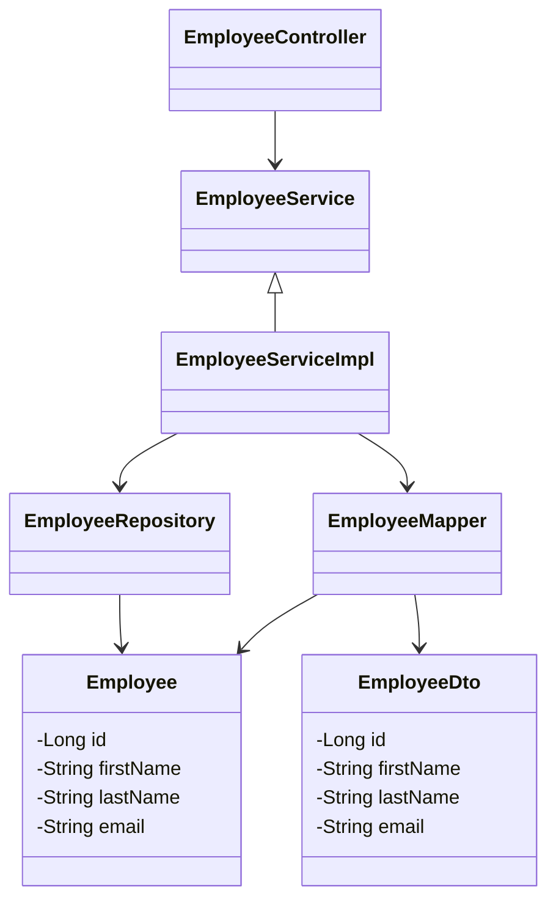

# Employee Management System (EMS) Backend

RESTful API para Gerenciamento de Funcionários construída em Java com Spring Boot.

## Principais Tecnologias
- **Java**: Utilizamos a versão mais recente do Java para tirar vantagem das últimas inovações que essa linguagem robusta oferece.
- **Spring Boot**: Framework que maximiza a produtividade do desenvolvedor por meio de sua poderosa premissa de autoconfiguração.
- **Spring Data JPA**: Ferramenta que simplifica nossa camada de acesso aos dados, facilitando a integração com bancos de dados SQL.
- **PostgreSQL**: Banco de dados utilizado para armazenar as informações dos funcionários.
- **Lombok**: Biblioteca que reduz a verbosidade do código Java, gerando automaticamente métodos getter, setter, construtores, entre outros.

## Estrutura do Projeto

### Diagrama de Classes



## Controladores

- **EmployeeController**: Controla as requisições HTTP e mapeia os endpoints para as operações CRUD dos funcionários.

## DTOs (Data Transfer Objects)

- **EmployeeDto**: Objeto de transferência de dados utilizado para encapsular os dados dos funcionários.

## Entidades

- **Employee**: Representa a entidade de funcionário armazenada no banco de dados.

## Exceções

- **ResourceNotFoundException**: Exceção personalizada para tratar casos onde um recurso (funcionário) não é encontrado.

## Mapeadores

- **EmployeeMapper**: Utilitário para converter entre Employee e EmployeeDto.

## Repositórios

- **EmployeeRepository**: Interface que estende JpaRepository para realizar operações CRUD no banco de dados.

## Serviços

- **EmployeeService**: Interface que define os métodos para manipulação de funcionários.
- **EmployeeServiceImpl**: Implementação da interface EmployeeService, contendo a lógica de negócio.

## Endpoints da API

### Criar Funcionário

Cria um novo funcionário no sistema.

- **URL:** `/api/employees`
- **Método:** `POST`
- **Requisição:** `EmployeeDto` (JSON)
- **Resposta:** `201 Created`, `EmployeeDto` (JSON)

### Obter Funcionário por ID

Retorna os detalhes de um funcionário pelo seu ID.

- **URL:** `/api/employees/{id}`
- **Método:** `GET`
- **Parâmetro:** `id` - ID do funcionário
- **Resposta:** `200 OK`, `EmployeeDto` (JSON)

### Obter Todos os Funcionários

Retorna uma lista de todos os funcionários.

- **URL:** `/api/employees`
- **Método:** `GET`
- **Resposta:** `200 OK`, Lista de `EmployeeDto` (JSON)

### Atualizar Funcionário

Atualiza os detalhes de um funcionário pelo seu ID.

- **URL:** `/api/employees/{id}`
- **Método:** `PUT`
- **Parâmetro:** `id` - ID do funcionário
- **Requisição:** `EmployeeDto` (JSON)
- **Resposta:** `200 OK`, `EmployeeDto` (JSON)

### Deletar Funcionário

Deleta um funcionário pelo seu ID.

- **URL:** `/api/employees/{id}`
- **Método:** `DELETE`
- **Parâmetro:** `id` - ID do funcionário
- **Resposta:** `200 OK`, Mensagem de confirmação

## Configurações

### Banco de Dados

- **URL:** `jdbc:postgresql://localhost:5432/ems`
- **Usuário:** `postgres`
- **Senha:** `postgres`
- **Driver:** `org.postgresql.Driver`

### Aplicação

- **Nome da Aplicação:** `ems-backend`

### Maven

- **Dependências principais:**
  - `spring-boot-starter-data-jpa`
  - `spring-boot-starter-web`
  - `postgresql`
  - `lombok`
  - `spring-boot-starter-test`
  - `org.jetbrains.annotations`

## Executando a Aplicação

Para executar a aplicação, use o comando abaixo na raiz do projeto:

```bash
./mvnw spring-boot:run
```

A aplicação será iniciada e estará disponível em [http://localhost:8080](http://localhost:8080).

Este documento fornece uma visão geral das funcionalidades e da estrutura do sistema de Gerenciamento de Funcionários. <br>
Para mais detalhes sobre a implementação e o uso dos endpoints, consulte a documentação da API ou o código fonte do projeto.
